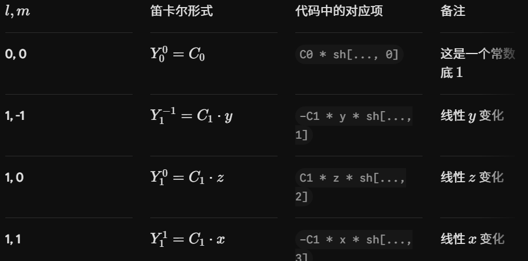

# 球谐函数
数学来源：球谐函数定义球谐函数 $Y_l^m(\theta, \phi)$ 本质上是由勒让德多项式 (Associated Legendre Polynomials) 乘以一个角度相关的正弦/余弦项构成的：$$Y_l^m(\theta, \phi) = N_l^m \cdot P_l^m(\cos \theta) \cdot e^{im\phi}$$
$N_l^m$：这就是你看到的那些常数（归一化因子），目的是为了确保函数满足 $\int |Y|^2 d\Omega = 1$。$P_l^m$：勒让德多项式，负责定义函数在球面上的波动频率。2. 为什么会有这些具体的浮点数（如 0.28209...）？这些常数是为了在编程实现时消除复杂的开方和阶乘运算。它们是由以下公式推导出来的：$$N_l^m = \sqrt{\frac{2l+1}{4\pi} \frac{(l-m)!}{(l+m)!}}$$当你计算 $l=0, m=0$ 时：$$N_0^0 = \sqrt{\frac{1}{4\pi}} \approx 0.28209479...$$这就是代码里的 C0。同理，计算 $l=1$ 的三个项时：$$N_1^0 = \sqrt{\frac{3}{4\pi}} \approx 0.4886025...$$这就是代码里的 C1。

数学定义的球谐函数（归一化后）在笛卡尔坐标下的表达如下： 

# 协方差（高斯球形状）
在 3DGS 中，高斯球的形状通过一个 3x3 的*对称正定矩阵*来表示。
代码采用了数学上非常经典的Cholesky 分解形式来构建这个矩阵。

协方差矩阵 $\Sigma$ 必须是半正定对称矩阵，否则它无法代表一个合法的空间概率分布。 
为了保证 $\Sigma$ 始终是合法的，3DGS 不直接训练 $\Sigma$ 的 9 个参数，而是将其分解为： 
$$\Sigma = R \cdot S \cdot S^T \cdot R^T = (RS) \cdot (RS)^T = L \cdot L^T$$
$S$ (Scaling)：一个对角矩阵，代表椭球在 X, Y, Z 三个轴上的拉伸程度。 
$R$ (Rotation)：一个旋转矩阵，代表椭球在空间中的朝向。 
$L$ (Cholesky Factor)：代码中的 $L$ 即为 $R \cdot S$ 的乘积。 

# 四元数与旋转矩阵
如果有一个单位四元数 $q = w + xi + yj + zk$，它对应的旋转矩阵 $R$ 为：$$R = \begin{bmatrix} 
1 - 2(y^2 + z^2) & 2(xy - wz) & 2(xz + wy) \\
2(xy + wz) & 1 - 2(x^2 + z^2) & 2(yz - wx) \\
2(xz - wy) & 2(yz + wx) & 1 - 2(x^2 + y^2)
\end{bmatrix}$$

# dist2 = torch.clamp_min(distCUDA2(torch.from_numpy(np.asarray(pcd.points)).float().cuda()), 0.0000001
distCUDA2(...)：寻找最近邻距离 
这是 3DGS 源码中一个专门优化的 CUDA 函数。它的逻辑大致如下：输入：点云的所有坐标（pcd.points）。计算：对于每一个点，找到距离它最近的 3 个点（$k=3$）。输出：返回一个数组，包含每个点到其最近邻点的距离的平方（$dist^2$）。

为什么要算这个距离？ 
它是 3D 高斯球“初始大小”的来源： 
在 3DGS 初始化时，我们希望高斯球的大小能够适配场景的局部密度： 
如果点云分布稀疏，点与点之间距离很远，那么对应的高斯球就应该设置得大一点。 
如果点云分布密集，高斯球就应该小一点。 

# FoVx 和 FoVy
FoVx 和 FoVy (Field of View in X/Y): 水平视场角和垂直视场角。
它们定义了相机视锥体（Frustum）的张开程度。
比如，FoVx 越大，视野越宽，图像里的物体显得越小（广角）；FoVx 越小，视野越窄，图像里的物体显得越大（长焦）。

# submodules文件夹
1. diff-gaussian-rasterization (核心引擎)
这是最重要的模块，它实现了 3D 高斯球的光栅化（Rasterization）算法。
它是做什么的？
它直接处理数百万个 3D 高斯球，并将它们实时投影到 2D 图像平面上。
它实现了可微渲染（Differentiable Rendering），这意味着它不仅能负责“画出图像”，还能计算出渲染结果相对于高斯球参数（位置、旋转、颜色等）的梯度，从而让模型可以通过梯度下降进行学习。
为什么独立出来？因为它是高度优化过的 CUDA 代码。Python 处理百万级点的循环会极其缓慢，必须通过 C++/CUDA 在 GPU 上运行，才能达到实时（每秒几十帧）的渲染速度。

2. simple-knn (空间搜索模块)
这是用于 “空间自适应” 的算法库。
它是做什么的？
它的全称是 Simple K-Nearest Neighbors。它的作用是为每个高斯球寻找它在 3D 空间中最近的 $K$ 个邻居（通常 $K=3$）。
为什么需要它？
正如你之前问到的 distCUDA2，我们需要通过邻居的距离来计算每个高斯球的初始大小（Scaling）。
如果没有这个模块，我们就无法实现场景的“自适应密度控制”——即无法根据点云的疏密程度自动分配高斯球的覆盖范围。

3. fused-ssim (评估指标模块)
这是用于 “模型质量评价” 的工具。
它是做什么的？
它的全称是 Fused Structural Similarity Index Measure。SSIM 是一种衡量两张图片相似度的算法（比简单的 MSE 均方误差更能反映人眼感受）。
为什么需要它？
3DGS 的训练目标不仅仅是让像素值吻合，更是要让渲染出的图像在结构上看起来真实。
fused 代表它是一个融合优化版本。它将图像的对比度、亮度、结构相似性计算合并在一次 GPU 操作中，相比传统的 CPU 实现，极大加快了训练期间评价模型效果的速度。

# diff-gaussian-rasterization文件夹，一个cuda文件都有什么
|   .gitignore
|   .gitmodules
|   CMakeLists.txt
这是 C++ 的项目配置文件。当你运行 pip install . 时，它会告诉系统：“我们需要用 CMake 来编译这个项目，记得链接 CUDA 库”。没有它，Python 无法调用 C++ 代码。
|   ext.cpp
这是 Python 和 C++ 之间的翻译官（通常利用 PyTorch 的 pybind11）。它告诉 Python：“我这里有一个 rasterize_gaussians 函数，你传给我 Tensor，我传给你渲染结果”。
|   LICENSE.md
|   rasterize_points.cu
|   rasterize_points.h
这是“对外接口”。它负责把 Python 传进来的 Tensor（比如相机矩阵、高斯参数）转换成 GPU 能看得懂的内存布局，然后调用 cuda_rasterizer 里的函数。
|   README.md
|   setup.py
这是 Python 的安装入口。当你执行 pip install . 时，它会调用上面的 CMakeLists.txt，把那一堆 .cu 和 .cpp 文件编译成一个 Python 可以直接调用的二进制库（通常是 .so 或 .pyd 文件）。
|   
+---cuda_rasterizer
这是真正的心脏。它实现了 3DGS 最底层的逻辑：如何把百万个高斯球像撒点一样投影到屏幕，并计算每个像素的颜色。
|       auxiliary.h
|       backward.cu
|       backward.h
|       config.h
|       forward.cu
|       forward.h
|       rasterizer.h
|       rasterizer_impl.cu
|       rasterizer_impl.h
|       
+---diff_gaussian_rasterization
|       __init__.py
|       
\---third_party存放第三方代码。比如 3DGS 用到了一些别人写好的、极其高效的数学计算库（如 glm），这些不需要自己重新造轮子。
    |   stbi_image_write.h
    |   
    \---glm

# NDC 坐标系
NDC 坐标系（Normalized Device Coordinates，归一化设备坐标系）是连接“ 3D 虚拟世界”与“ 2D 显示屏幕”之间的桥梁。 
简单来说，NDC 就是一个把所有可见物体都统一压缩进一个“标准立方体”里的空间。 
1. 为什么需要 NDC？ 
想象一下，我们在 3D 空间中建模，坐标可以是任意数值（比如桌子在 $x=1000$ 米，椅子在 $x=-5$ 米）。如果我们直接用这些原始坐标去告诉显卡“把这个像素画在哪里”，显卡会完全崩溃，因为显卡只关心屏幕上的像素位置（比如 $0 \sim 1920$）。 
NDC 的作用就是“标准化”：无论你在 3D 空间里的物体离得有多远、视角有多广，NDC 坐标系都会把所有在相机视野内（Frustum）的点，映射到一个统一的、无量纲的坐标范围内。 
2. NDC 的标准范围在标准的 OpenGL/Vulkan 规范中，NDC 坐标系是一个 $[-1, 1]$ 的立方体： 
X 轴：$-1$（左）到 $1$（右） 
Y 轴：$-1$（下）到 $1$（上） 
Z 轴：$-1$（近裁剪面）到 $1$（远裁剪面） 

# 关于SH
SH 不是随便选的基函数，SH 的本质是球面上的傅里叶变换。它定义了一组正交基函数 $Y_{lm}(\theta, \phi)$。 
在 3DGS 中，为了方便计算，通常会将坐标转换到 Cartesian 坐标系（$x, y, z$）下，这些基函数就变成了关于 $x, y, z$ 的多项式。 
$0$ 阶（1个基函数）：是一个常数（$SH\_C0$）。 
$1$ 阶（3个基函数）：分别是 $y, z, x$ 的线性组合。 
$2$ 阶（5个基函数）：是 $xy, yz, (2z^2-x^2-y^2), xz, (x^2-y^2)$ 的组合。 
